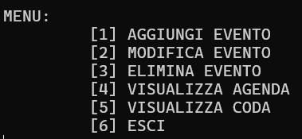
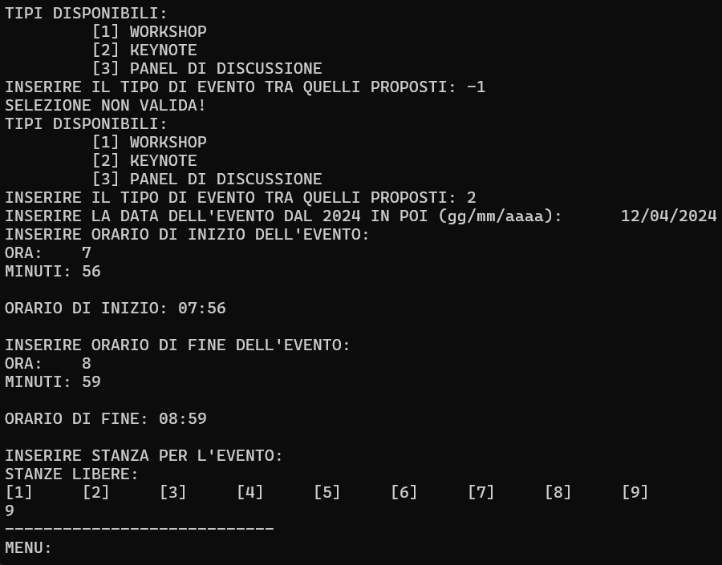
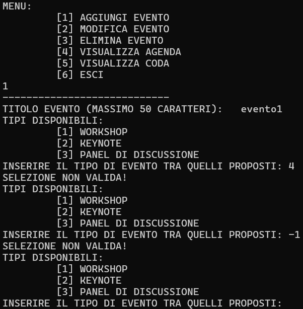

<h1 align = "center">ConferenceManager-PSD-</h1>

<h3>A simple application that let's the user manage conferences, events and such. This project is relevant to the Programming and data structures course.</h3>

The application makes use of files, data structures and the related algorithms to best manage the aforementioned events. 

---

Upon start the program will display the following menu...

The User can choose between three types of event, each of which must have a valid date and time, the user then has to choose which room the evetn will take place in

If the user makes any mistake in the event creation process, the program will proceed to notify the nature of the mistake and let the user try again

After the user has succesfully created the event the Menu will be displayed again. Upon close the program will either create if not found or update the <i>agenda.txt</i> file 

<img src = "images/full"
