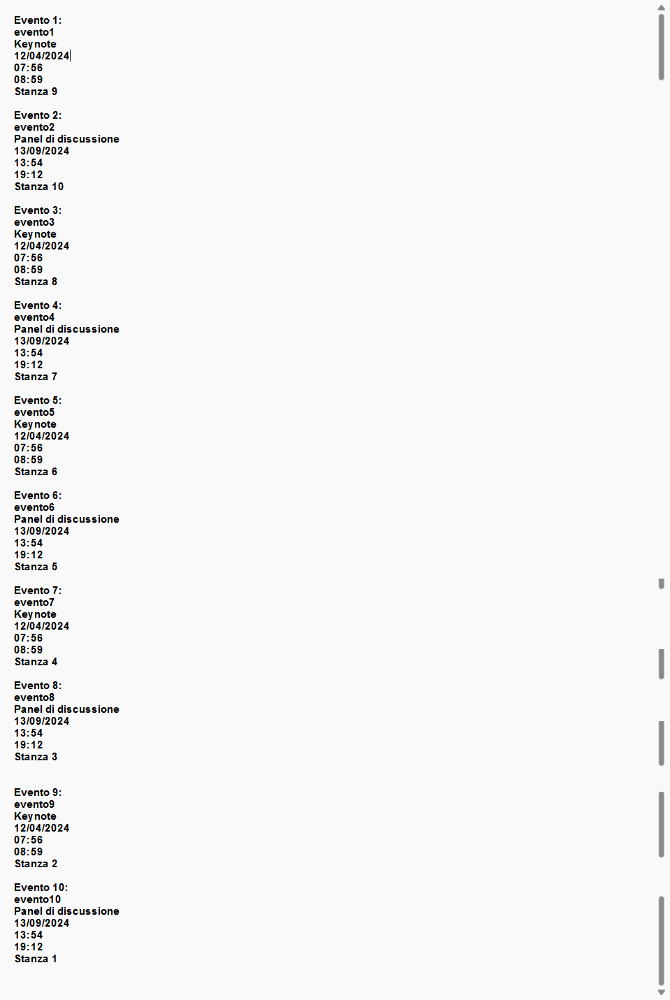
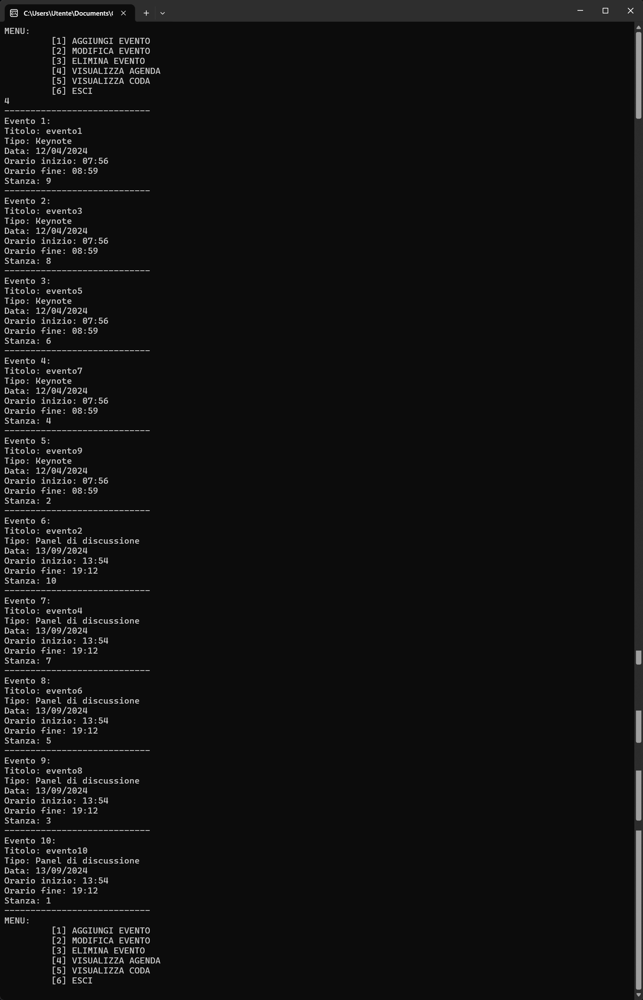
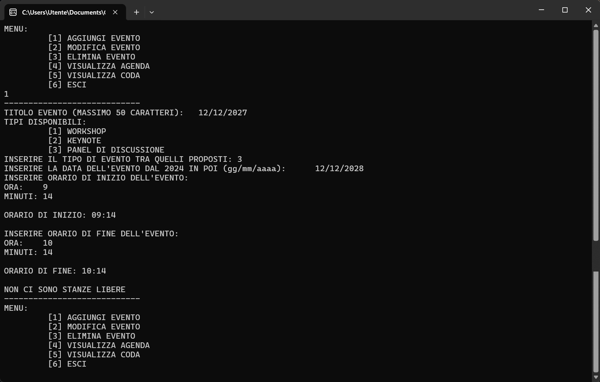
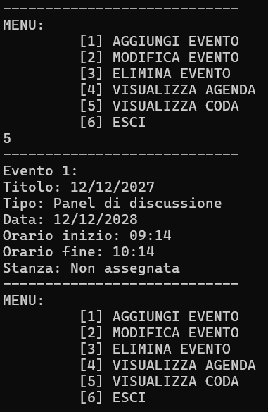
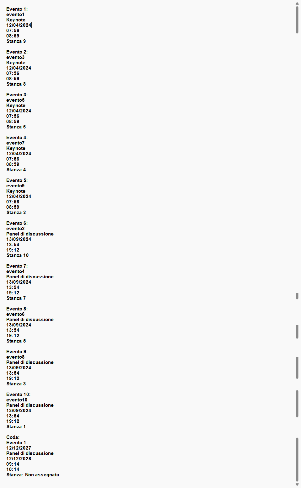

  

<h1 align="center">ConferenceManager-PSD-</h1>

  <strong>A simple application that lets the user manage conferences. This project is relevant to the Programming and Data Structures course.</strong>

The application makes use of files, data structures, and the related algorithms to best manage the aforementioned events.

The program is to be started by opening the <i>main.exe</i> file, once started, the program will display the following menu...

The user can create, modify, remove events, it can also visualize the current Agenda and Queue, the events are divided into three types, each of which must have a valid date and time. The user then...

If the user makes any mistakes in the event creation process, the program will notify the nature of the mistake and let the user try again.

After the user has successfully created the event, the menu will be displayed again. Upon close, the program will either create (if not found) or update the <i>agenda.txt</i> file.

If the user wants to create a new event and there are no rooms left vacant, the event will be added to the queue and will be assigned to a room as soon as one is freed. <i>Note: The maximum number...</i>

